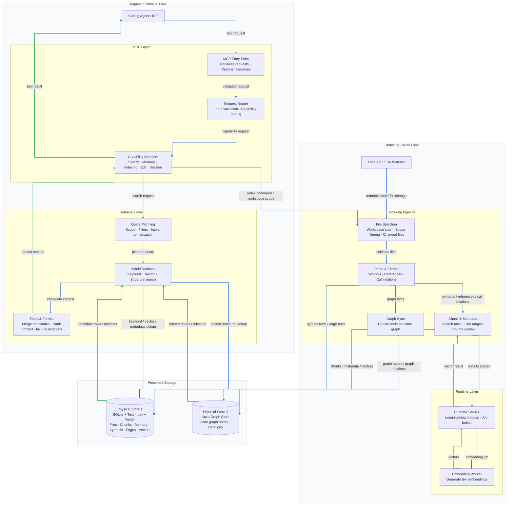

[Korean Version Available](README.md)

# Cortex Agent Infrastructure (`.cortex`)

**"The Bridge between Human Intent and Agent Intelligence."**

Cortex is a local-first agent infrastructure for persistent memory, semantic code search, graph analysis, and MCP integration. Install Cortex in a tool directory, add its built binaries to PATH, and run `cortex` from the project you want to use. By default, project data is created under `~/.cortex/workspaces/<workspace-key>/` unless `CORTEX_DATA_HOME` is set explicitly.

---

## System Architecture

The MCP server, tool dispatcher, vector engine server, watcher, and runtime control layers are separated from Python worker/helper code. `cortex` owns start/status/stop orchestration, while embedding, Kuzu graph integration, and parser implementations stay in Python to avoid heavy native Rust builds.


---

## Key Features

### 1. Hybrid Context Engine

- **Tree-sitter parsing**: extracts classes, functions, and call relationships from Python, C#, TypeScript, and related source files.
- **Vector search**: uses `sqlite-vec` for local semantic search.
- **Graph analysis**: stores call and containment relationships in Kuzu.
- **FTS5 search**: combines keyword search with Reciprocal Rank Fusion scoring.

### 2. Runtime Modularization

The runtime control layer is split across Rust crates:

- `rust/crates/ctl`: start/status/stop orchestration and process path management
- `rust/crates/runtime`: Rust engine router, worker supervisor, idle monitor, length-prefixed JSON IPC
- `rust/crates/watcher`: file watch, scan, parse, SQLite write path
- `src/cortex/runtime/engine_worker.py`: PyTorch/SentenceTransformers embedding worker

Python remains responsible for embedding workers/providers, Kuzu graph helpers, and parser helpers. Runtime orchestration and MCP run through Rust binaries.

### 3. Path Model

- `CORTEX_HOME`: Cortex package/runtime root.
- `CORTEX_WORKSPACE`: project root to index and edit.
- `CORTEX_DATA_HOME`: DB and index root. Defaults to `~/.cortex`; workspace data is stored under `workspaces/<workspace-key>/`.
- `CORTEX_WORKSPACE_KEY`: optional shared key for grouping multiple folders into one Cortex workspace.
- `CORTEX_ENV_PATH`: explicit dotenv path.
- `CORTEX_START_TIMEOUT`: seconds `cortex start` waits for the engine. Default 35; use 60-120 on WSL/CUDA. If the deadline elapses while the engine is still `loading`, `start` emits an INFO note and returns success while the engine keeps loading in the background.
- `CORTEX_DIAG_READY_TIMEOUT`: seconds the diagnostic scripts (`zombie-check.{sh,ps1}`) poll for `READY` before accepting `LOADING`. Default 90.

Code indexes, memory DBs, graph stores, and session history are created under `~/.cortex/workspaces/<workspace-key>/` by default. Set `CORTEX_DATA_HOME` and optionally `CORTEX_WORKSPACE_KEY` when multiple repositories should share one separate Cortex data directory.

---

## Directory Model

```text
.cortex/                                  # Cortex source/package root
├── hooks/                                # runtime lifecycle hooks
├── rules/                                # agent rules and editing policies
├── scripts/                              # Cortex modules, MCP server, runtime control
├── knowledge/
│   └── knowledge.zip                     # optional knowledge seed
├── pyproject.toml                        # uv dependency declaration
└── settings.yaml                         # infrastructure settings

~/.cortex/                                # CORTEX_DATA_HOME
├── .env                                  # optional global Cortex environment
└── workspaces/
    └── <workspace-key>/
        ├── memories.db
        ├── graph_db_store/
        └── history/
```

---

## Installation

Follow [INSTALL.en.md](./INSTALL.en.md) for the actual commands.

- WSL install: run the `Install On WSL / Linux` section in [INSTALL.en.md](./INSTALL.en.md) from top to bottom.
- Windows install: run the `Install On Windows PowerShell` section in [INSTALL.en.md](./INSTALL.en.md) from top to bottom.

Install flow summary:

- Clone and build Cortex in a tool directory you choose.
- Add the `cortex` binary directory to PATH.
- Run `cortex status` from the project you want to use Cortex with.
- Project data is created under `~/.cortex/workspaces/<workspace-key>/` by default.

Embedding is a core Cortex feature. On first use, the default model `Qwen/Qwen3-Embedding-0.6B` is downloaded into the HuggingFace cache. Public models work without a token.

Only GPU acceleration is optional. Add the GPU section in [INSTALL.en.md](./INSTALL.en.md) only for NVIDIA RTX 3000-series or newer GPUs, where Ampere-or-newer bf16/Flash-Attention paths are available.

---

## `cortex` Surface

```text
cortex start | stop | restart | status
cortex relay acquire | release | status | force-release
```

```text
cortex index | index scan | index roots | index add <path> | index remove <target> | index file <path>
```

---

## HuggingFace Token And Embedding Model

Embedding is a core Cortex feature. On first use, the default model `Qwen/Qwen3-Embedding-0.6B` is downloaded into the HuggingFace cache.

Public models work without a token. If you use gated models, authenticated downloads, or want fewer download limits, set the token in the environment you are using.

WSL / Linux:

```bash
export HF_TOKEN=<token>
```

Windows PowerShell:

```powershell
$env:HF_TOKEN = "<token>"
```

The default model cache is `~/.cache/huggingface/hub/` on Linux/WSL/macOS and `%USERPROFILE%\.cache\huggingface\hub\` on Windows. Set `HF_HOME` to move it.

Override the default model through environment variables:

```bash
export CORTEX_EMBEDDING_MODEL=google/embeddinggemma-300m
export CORTEX_EMBEDDING_MAX_SEQ_LENGTH=2048
```

Changing embedding model dimensions makes existing vectors incompatible. Rebuild the target workspace index after changing model family or vector dimension.

---

## Optional GPU Acceleration

GPU acceleration is optional. Add it only for NVIDIA RTX 3000-series or newer GPUs, where Ampere-or-newer bf16/Flash-Attention paths are available.

```bash
uv sync --extra gpu-accel
```

---

## MCP Registration

MCP entrypoints use the built `cortex-mcp` binary:

```powershell
$CORTEX_WORKSPACE = (Resolve-Path ..\your-project).Path

gemini mcp add -s user `
  -e CORTEX_WORKSPACE="$CORTEX_WORKSPACE" `
  -e CORTEX_DATA_HOME="$env:USERPROFILE\.cortex" `
  cortex-mcp -- "$env:LOCALAPPDATA/Cortex/rust/target/release/cortex-mcp.exe"
```

Pass `CORTEX_WORKSPACE`, `CORTEX_DATA_HOME`, and optionally `CORTEX_WORKSPACE_KEY` explicitly so the server resolves the same workspace data directory across platforms.

---

## CI Coverage

GitHub Actions verifies `uv sync --group dev`, `py_compile`, runtime import smoke checks, `pytest -m "not smoke"` regression tests, test workspace indexing, and `pytest -m smoke` MCP JSON-RPC smoke tests on Windows and Ubuntu. Long-running daemon behavior, real GPU/CUDA memory behavior, and local model cache state remain local validation targets. Use the [local validation section in INSTALL.en.md](./INSTALL.en.md#7-local-validation) for local process and VRAM checks.

---

## License

- **Code**: [MIT License](LICENSE)
- **Knowledge**: The external knowledge seed originates from [antigravity-awesome-skills](https://github.com/sickn33/antigravity-awesome-skills) and follows the [CC BY 4.0](https://creativecommons.org/licenses/by/4.0/) license.
