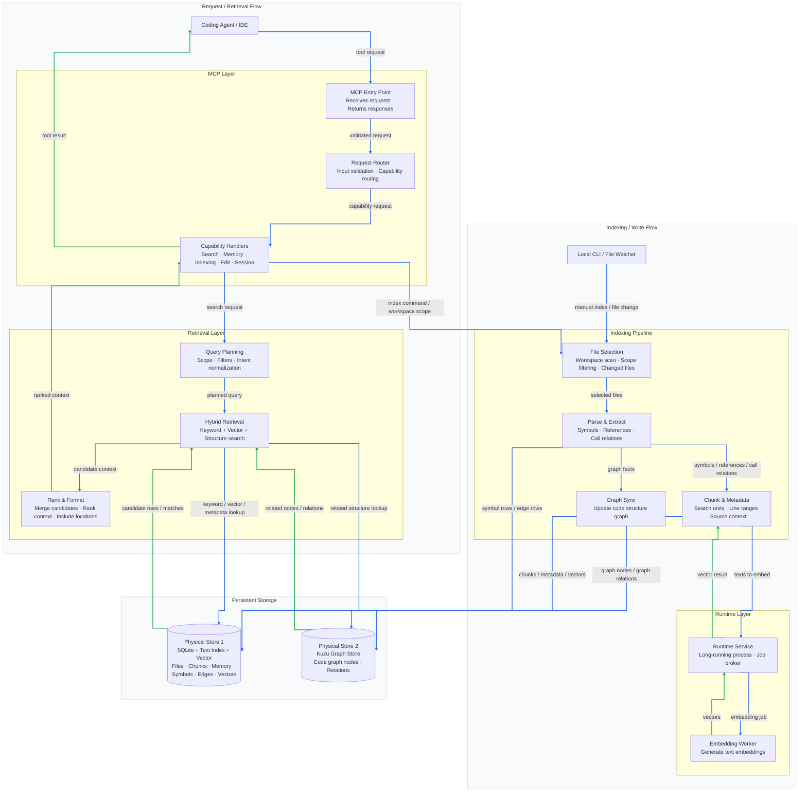

[Korean Version Available](README.md)

# Cortex Agent Infrastructure (`.cortex`)

**"The Bridge between Human Intent and Agent Intelligence."**

Cortex is a local-first agent infrastructure for persistent memory, semantic code search, graph analysis, and MCP integration. The current model installs Cortex once as a global tool and stores per-workspace data under `~/.cortex/workspaces/<key>/`, so user projects do not need to carry Cortex runtime files.

---

## System Architecture

The MCP server, tool dispatcher, vector engine server, watcher, and runtime control layers are separated from Python worker/helper code. `cortex-ctl` owns start/status/stop orchestration, while embedding, Kuzu graph integration, and parser implementations stay in Python to avoid heavy native Rust builds.


---

## Key Features

### 1. Hybrid Context Engine

- **Tree-sitter parsing**: extracts classes, functions, and call relationships from Python, C#, TypeScript, and related source files.
- **Vector search**: uses `sqlite-vec` for local semantic search.
- **Graph analysis**: stores call and containment relationships in Kuzu.
- **FTS5 search**: combines keyword search with Reciprocal Rank Fusion scoring.

### 2. Runtime Modularization

The runtime is split into path resolution, IPC, process launch, locks, logging, control, engine routing, worker lifecycle, and watcher launch modules under `cortex/runtime/`. This keeps GPU/PyTorch, Kuzu, and parser native-package integration inside Python helpers and leaves control/server/router code relatively lightweight.

### 3. Global Data Model

- `CORTEX_HOME`: Cortex package/runtime root.
- `CORTEX_WORKSPACE`: project root to index and edit.
- `CORTEX_DATA_HOME`: global data root, default `~/.cortex`.
- `CORTEX_WORKSPACE_KEY`: optional shared key for grouping multiple folders into one Cortex workspace.
- `CORTEX_ENV_PATH`: explicit dotenv path.
- `CORTEX_START_TIMEOUT`: seconds `cortex-ctl start` waits for the engine. Default 35; use 60-120 on WSL/CUDA. If the deadline elapses while the engine is still `loading`, `start` emits an INFO note and returns success while the engine keeps loading in the background.
- `CORTEX_DIAG_READY_TIMEOUT`: seconds the diagnostic scripts (`zombie-check.{sh,ps1}`) poll for `READY` before accepting `LOADING`. Default 90.

Code indexes, memory DBs, graph stores, and session history live under `<CORTEX_DATA_HOME>/workspaces/<key>/`. The default key is derived from the workspace path; set `CORTEX_WORKSPACE_KEY` when multiple repositories should share one Cortex data directory.

---

## Directory Model

```text
.cortex/                                  # Cortex source/package root
├── hooks/                                # runtime lifecycle hooks
├── rules/                                # agent rules and editing policies
├── scripts/                              # Cortex modules, MCP server, runtime control
├── knowledge/
│   └── knowledge.zip                     # optional knowledge seed
├── pyproject.toml                        # uv dependency declaration
└── settings.yaml                         # infrastructure settings

~/.cortex/                                # CORTEX_DATA_HOME
├── .env                                  # optional global Cortex environment
└── workspaces/
    └── <workspace-key>/
        ├── memories.db
        ├── graph_db_store/
        └── history/
```

---

## Installation

See [INSTALL.en.md](./INSTALL.en.md) for the full installation guide.

Release package install:

```powershell
.\install.ps1
cortex-ctl status
```

Build from source:

```powershell
git clone https://github.com/kth3/Cortex-agents_infra.git
cd Cortex-agents_infra
uv sync
cargo build --manifest-path rust/Cargo.toml --release `
  -p cortex-ctl `
  -p cortex-runtime `
  -p cortex-watcher `
  -p cortex-mcp
```

---

## `cortex-ctl` Surface

```text
cortex-ctl start | stop | restart | status
cortex-ctl relay acquire | release | status | force-release
```

---

## HuggingFace Token Policy

Cortex does not require `HF_TOKEN` for public models. Use one of these methods only when a gated model or faster authenticated access is needed:

| Method | Behavior |
|---|---|
| `HF_TOKEN=<T>` environment variable | Uses the shell-provided token. |
| `huggingface-cli login` | Uses the standard `~/.cache/huggingface/token` file. |
| Managed `.env` or wrapper script | Loads the token before starting Cortex. |

The implementation passes `token=None` when `HF_TOKEN` is unset or blank, so the HuggingFace library can still use its standard cached-token fallback.

---

## Embedding Model Policy

Default model:

```text
Qwen/Qwen3-Embedding-0.6B
max_seq_length = 4096
```

Override through environment variables:

```bash
export CORTEX_EMBEDDING_MODEL=google/embeddinggemma-300m
export CORTEX_EMBEDDING_MAX_SEQ_LENGTH=2048
```

`trust_remote_code` is disabled by default. The default Qwen embedding model requires it, so enable it explicitly after reviewing the model code:

```bash
export CORTEX_EMBEDDING_TRUST_REMOTE_CODE=true
```

Changing embedding model dimensions makes existing vectors incompatible. Rebuild the target workspace index after changing model family or vector dimension.

---

## MCP Registration

MCP entrypoints use the package `bin\cortex-mcp.exe` binary:

```powershell
$CORTEX_WORKSPACE = (Resolve-Path ..\your-project).Path

gemini mcp add -s user `
  -e CORTEX_WORKSPACE="$CORTEX_WORKSPACE" `
  -e CORTEX_DATA_HOME="$env:USERPROFILE\.cortex" `
  cortex-mcp -- ".\bin\cortex-mcp.exe"
```

Pass `CORTEX_WORKSPACE`, `CORTEX_DATA_HOME`, and optionally `CORTEX_WORKSPACE_KEY` explicitly so the server resolves the same workspace data directory across platforms.

---

## CI Coverage

GitHub Actions verifies `uv sync --group dev`, `py_compile`, runtime import smoke checks, `pytest -m "not smoke"` regression tests, test workspace indexing, and `pytest -m smoke` MCP JSON-RPC smoke tests on Windows and Ubuntu. Long-running daemon behavior, real GPU/CUDA memory behavior, and local model cache state remain local validation targets. Use the [OS Validation Runbook](./docs/runbook-os-validation.md) for local process and VRAM checks.

---

## License

- **Code**: [MIT License](LICENSE)
- **Knowledge**: The external knowledge seed originates from [antigravity-awesome-skills](https://github.com/sickn33/antigravity-awesome-skills) and follows the [CC BY 4.0](https://creativecommons.org/licenses/by/4.0/) license.
