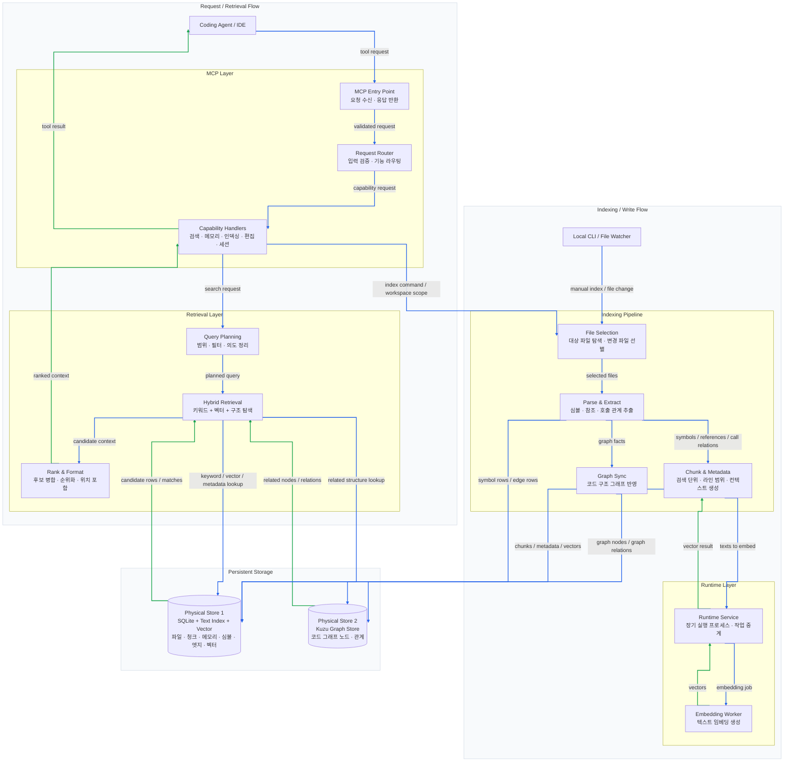

[English Version Available](README.en.md)

# Cortex Agent Infrastructure (`.cortex`)

**"The Bridge between Human Intent and Agent Intelligence."**

파편화된 에이전트의 기억을 영속화하고, MCP(Model Context Protocol)를 통해 어떤 프로젝트에서든 즉시 작업 맥락을 형성할 수 있도록 설계된 범용 에이전트 엔지니어링 인프라입니다. 최신 멀티 에이전트 오케스트레이션 패턴과 하이브리드 데이터베이스 기술을 결합하여 로컬 우선 컨텍스트 엔진을 제공합니다.

최근 구조는 `.cortex` 경로 모델을 기본으로 사용하며, MCP, watcher, process control, runtime router를 Rust crate로 분리하는 방향으로 정리되었습니다.

---

## 시스템 아키텍처

기존 Python 단일체 엔진은 Rust MCP dispatcher, Rust engine server, Rust watcher, Rust process control 계층과 Python worker/helper 계층으로 분리되었습니다. `cortex`, `cortex-engine`, `cortex-mcp`, `cortex-watcher`가 운영 표면을 담당하고 Python은 embedding worker와 Kuzu graph helper처럼 무거운 네이티브 패키지 연동을 담당합니다.



## 주요 특징

### 1. Hybrid Context Engine & AST Parsing

- **AST Structural Parsing (`Tree-sitter`)**: Python, C#, TypeScript 등의 코드를 AST 수준으로 분석하여 클래스, 함수, 호출 관계를 추출합니다.
- **Vector Search (`sqlite-vec`)**: 로컬 SQLite 기반 벡터 검색으로 외부 서버 없이 시맨틱 검색을 수행합니다.
- **Graph Analysis (`Kuzu DB`)**: 함수 호출, 포함 관계, 외부 참조를 그래프 형태로 추적합니다.
- **FTS5 Text Search**: 키워드 기반 검색과 RRF(Reciprocal Rank Fusion) 결합을 지원합니다.

### 2. Runtime Modularization

런타임 제어 계층은 다음처럼 분리되어 있습니다.

- `rust/crates/ctl`: start/status/stop orchestration과 프로세스 경로 관리
- `rust/crates/runtime`: Rust engine router, worker supervisor, idle monitor, length-prefixed JSON IPC
- `rust/crates/ctl`: start/status/stop orchestration
- `rust/crates/watcher`: file watch, scan, parse, SQLite write path
- `src/cortex/runtime/engine_worker.py`: PyTorch/SentenceTransformers embedding worker

Python은 embedding 모델 생태계에 필요한 worker/provider, Kuzu graph helper, parser helper 영역에 남고, runtime orchestration과 MCP는 Rust 바이너리 기준으로 동작합니다.

### 3. `.cortex` Path Model

Cortex 본체 설치 위치와 작업 프로젝트 데이터 위치를 분리합니다.

- `CORTEX_HOME`: Cortex 본체 루트 (`pyproject.toml`이 있는 위치)
- `CORTEX_WORKSPACE`: 실제 작업 대상 프로젝트 루트
- `CORTEX_DATA_HOME`: DB·인덱스 루트. 기본값은 `~/.cortex`이며, 워크스페이스별 데이터는 `workspaces/<workspace-key>/` 아래에 저장
- `CORTEX_WORKSPACE_KEY`: 멀티레포 그룹화 — 여러 폴더를 한 워크스페이스로 묶을 때 동일 값을 박는다
- `CORTEX_ENV_PATH`: `.env` 파일 위치를 직접 지정할 때 사용
- `CORTEX_START_TIMEOUT`: `cortex start`가 엔진 ready를 기다리는 시간(초). 기본 35, WSL/CUDA에선 60~120 권장. timeout 도달 시 엔진이 `loading` 상태라면 INFO 메시지와 함께 백그라운드 로딩을 인정하고 success 반환
- `CORTEX_DIAG_READY_TIMEOUT`: 진단 스크립트(`zombie-check.{sh,ps1}`)의 READY 폴링 시간(초). 기본 90

코드 인덱스(`memories.db`, `graph_db_store/`)와 히스토리는 기본적으로 `~/.cortex/workspaces/<workspace-key>/` 아래에 생성됩니다. `CORTEX_DATA_HOME`을 명시하면 다른 전역 데이터 루트를 사용할 수 있습니다. Cortex 본체 업데이트는 사용자가 지정한 본체 설치 폴더에서 수행합니다.

### 4. Multi-Lane Parallel Execution

도메인(Lane) 기반 병렬 락 시스템을 통해 여러 터미널 또는 에이전트가 동시에 작업할 때 충돌을 줄입니다. 릴레이 계층은 작업 핸드오프와 동시성 제어를 담당합니다.

### 5. Hardware-Aware Embedding Strategy

SentenceTransformers/PyTorch 기반 embedding worker를 별도 프로세스로 격리합니다. GPU/MPS/CUDA 사용은 Python worker에 남겨 두고, control/server/router 계층은 모델 의존성을 낮춘 구조로 유지합니다.

---

## 디렉토리 구조

```text
.cortex/                                  # cortex 본체
├── docs/                                 # 인프라 관련 문서
├── hooks/                                # 런타임 라이프사이클 훅
├── rules/                                # 에이전트 행동 규칙 및 정밀 편집 지침
├── scripts/                              # Cortex 코어 모듈, MCP 서버, runtime 제어 계층
├── tasks/                                # 능동적 추적을 위한 작업 문서
├── templates/                            # 시스템 템플릿 및 ignore 번들
├── knowledge/
│   └── knowledge.zip                     # 외부 지식 시드 (선택 전개)
├── pyproject.toml                        # uv 기반 의존성 선언
├── .venv/                                # [비공유] uv 가상 환경
├── uv.lock                               # 패키지 잠금 파일
└── settings.yaml                         # 인프라 전역 설정

~/.cortex/                                # 글로벌 데이터 루트 (CORTEX_DATA_HOME)
└── workspaces/
    └── <sha1-of-workspace-path>/         # 워크스페이스별 격리
        ├── memories.db                   # 메모리·관찰·세션 (sqlite + vec)
        ├── graph_db_store/               # 코드 그래프 (kuzu)
        └── history/                      # 세션 로그·관찰 이력
```

---

## Cortex Modular Layout

최근 구조 개편에 따라 Cortex 백엔드는 Rust crate 중심으로 분리되었습니다. SQLite, 검색, 메모리, 편집, watcher 제어는 Rust에 위치하고 Python은 임베딩 worker/provider, Kuzu graph helper, parser helper를 유지합니다:

- `rust/crates/mcp`: MCP JSON-RPC 도구 catalog, 검색, 메모리, 편집, 세션 도구
- `rust/crates/storage`: SQLite 스키마, resolver, 공용 저장소 접근, Python Kuzu bridge
- `rust/crates/scanner`: `.gitignore` 기반 파일 탐색과 필터
- `rust/crates/parsers`: Python parser helper bridge와 공용 JSON 스키마 타입
- `rust/crates/watcher`: file watch, scan, parse, SQLite write path
- `rust/crates/runtime`: 데몬 라우터, worker supervisor, IPC 등 실행 환경 인프라
- `src/cortex/embeddings`, `src/cortex/runtime/engine_worker.py`: PyTorch/SentenceTransformers 모델 로드와 추론
- `src/cortex/storage/graph.py`: Python Kuzu sync/query helper
- `src/cortex/parsers`: Python parser helper와 언어별 파서 구현

> 외부 Workspace 경로 대응은 Rust `cortex`/`cortex-engine` 경로 정책을 따르며, 모델 다운로드나 GPU 토큰 의존성 검증은 기본 CI에서 제외되고 로컬 구성 이후의 별도 검증 대상으로 분류됩니다.

---

## 설치 및 사용

상세 설치 명령은 [INSTALL.md](./INSTALL.md)를 따릅니다.

- WSL에서 설치: [INSTALL.md](./INSTALL.md)의 `WSL / Linux에서 설치` 섹션을 위에서 아래로 실행합니다.
- Windows에서 설치: [INSTALL.md](./INSTALL.md)의 `Windows PowerShell에서 설치` 섹션을 위에서 아래로 실행합니다.

설치 흐름 요약:

- Cortex 본체는 사용자가 정한 도구 설치 폴더에 clone하고 빌드합니다.
- `cortex` 실행 파일 경로를 PATH에 추가합니다.
- 실제 작업 프로젝트에서 `cortex status`를 실행합니다.
- 작업 프로젝트의 데이터는 기본적으로 `~/.cortex/workspaces/<workspace-key>/` 아래에 생성됩니다.

임베딩은 Cortex 기본 기능입니다. 첫 실행 시 기본 모델 `Qwen/Qwen3-Embedding-0.6B`가 HuggingFace 캐시에 다운로드됩니다. 공개 모델만 사용할 때는 토큰이 없어도 됩니다.

GPU 가속만 선택 사항입니다. NVIDIA RTX 3000번대 이상처럼 Ampere 이상 GPU에서 bf16/Flash-Attention 경로를 사용할 때만 [INSTALL.md](./INSTALL.md)의 GPU 가속 섹션을 추가로 따릅니다.

### cortex 명령 표면

```text
cortex start | stop | restart | status        # MCP 엔진 라이프사이클
cortex relay acquire | release | status | force-release
```

```text
cortex index | index scan | index roots | index add <path> | index remove <target> | index file <path>
```

### MCP 등록

MCP 등록은 빌드된 Rust `cortex-mcp` 바이너리를 기준으로 합니다. `CORTEX_WORKSPACE`, `CORTEX_DATA_HOME`, 필요 시 `CORTEX_WORKSPACE_KEY`를 명시해 플랫폼별 데이터 경로가 갈라지지 않게 합니다.

```powershell
$CORTEX_WORKSPACE = (Resolve-Path ..\your-project).Path

gemini mcp add -s user `
  -e CORTEX_WORKSPACE="$CORTEX_WORKSPACE" `
  -e CORTEX_DATA_HOME="$env:USERPROFILE\.cortex" `
  cortex-mcp -- "$env:LOCALAPPDATA/Cortex/rust/target/release/cortex-mcp.exe"
```

---

## CI 검증 범위

GitHub Actions는 Windows와 Ubuntu에서 다음을 검증합니다.

- `uv sync --group dev` 기반 의존성 설치
- Rust workspace build/test
- embedding worker/provider import smoke
- 유지 Python 테스트
- `.cortex` 기준 테스트 워크스페이스 인덱싱
- Rust MCP JSON-RPC smoke test

장시간 daemon 실기동, 실제 GPU/CUDA 메모리 동작, 로컬 모델 캐시 상태는 환경 의존성이 높아 로컬 검증 대상으로 둡니다. 실측 절차는 [OS Validation Runbook](./docs/runbook-os-validation.md)에 정리합니다.

---

## 영감 및 참고

- **Vexp**: 범용 워크플로 프레임워크 구조와 DB 스키마 형식 참고
- **oh-my-agent**: 역할 기반 에이전트 전문화 및 포터블 에이전트 정의 개념
- **oh-my-claudecode**: 심층 인터뷰와 아티팩트 기반 핸드오프 패턴
- **oh-my-openagent**: 해시 기반 정밀 편집과 검증 루프 패턴

---

## 라이선스

- **Code**: [MIT License](LICENSE)
- **Knowledge**: 외부 지식 라이브러리의 원본은 [antigravity-awesome-skills](https://github.com/sickn33/antigravity-awesome-skills)이며 [CC BY 4.0](https://creativecommons.org/licenses/by/4.0/) 라이선스를 따릅니다.

